# PetCare — Database Design

**Engine:** MySQL 8.0.16+ · **Charset:** `utf8mb4_unicode_ci` (Bangla-safe) · **Storage:** InnoDB
**Schema:** 29 tables · 3 triggers · 3 views · full DDL in [`database/schema.sql`](../database/schema.sql)

---

## 1. Design Principles

1. **Surrogate keys** — every entity uses `BIGINT UNSIGNED AUTO_INCREMENT id`; natural keys (emails, license numbers) get `UNIQUE` constraints instead.
2. **Deliberate `ON DELETE` behavior** — `CASCADE` for owned data (a shelter's pets die with the shelter), `SET NULL` for historical references (a donation outlives its donor), `RESTRICT` for anything money- or welfare-critical (redemptions, crisis foster assignments).
3. **Derived values are documented** — `donation_campaigns.raised_amount` is technically derivable via `SUM(donations.amount)`. It is **denormalized on purpose** and maintained by triggers, because every donation page and dashboard reads it on each request. This is a classic, justified read-optimization (see §5).
4. **No CSV-in-a-column** — pet personality tags live in a `pet_tags` junction table (1NF-safe), not a comma-separated string.
5. **Privacy by schema** — `safe_haven_requests` stores an anonymous `requester_code`, not a `user_id`. It is structurally impossible to leak a crisis requester's identity through a JOIN.

---

## 2. Entity-Relationship Diagram

The diagram below renders natively on GitHub. Domains: **Users/Orgs**, **Adoption (M1)**, **Donations (M2)**, **Vet Care (M3)**, and unique modules **U1–U7**.

```mermaid
erDiagram
    USERS ||--o| SHELTERS : "runs (1:1)"
    USERS ||--o| VET_CLINICS : "owns (1:1)"

    SHELTERS ||--o{ PETS : "houses"
    PETS ||--o{ PET_PHOTOS : "has"
    PETS ||--o{ PET_TAGS : "tagged"
    PETS ||--o{ ADOPTION_APPLICATIONS : "receives"
    USERS ||--o{ ADOPTION_APPLICATIONS : "submits"

    SHELTERS ||--o{ DONATION_CAMPAIGNS : "creates"
    PETS |o--o{ DONATION_CAMPAIGNS : "benefits"
    DONATION_CAMPAIGNS ||--o{ DONATIONS : "collects"
    USERS |o--o{ DONATIONS : "makes"
    SHELTERS ||--o{ SHELTER_WISH_ITEMS : "lists"

    VET_CLINICS ||--o{ VET_REVIEWS : "receives"
    USERS ||--o{ VET_REVIEWS : "writes"
    USERS ||--o{ PET_MEDICAL_REMINDERS : "sets"

    USERS ||--o{ PET_BLOOD_DONORS : "registers"
    VET_CLINICS |o--o{ PET_BLOOD_DONORS : "preferred"
    VET_CLINICS ||--o{ BLOOD_REQUESTS : "posts"

    USERS |o--o{ LOST_PET_REPORTS : "files"
    USERS |o--o{ FOUND_PET_REPORTS : "files"
    LOST_PET_REPORTS ||--o{ LOST_FOUND_MATCHES : "matched in"
    FOUND_PET_REPORTS ||--o{ LOST_FOUND_MATCHES : "matched in"

    USERS ||--o{ KARMA_LEDGER : "earns"
    USERS ||--o{ KARMA_REDEMPTIONS : "redeems"
    REWARDS_CATALOG ||--o{ KARMA_REDEMPTIONS : "claimed via"

    USERS ||--o| COMPATIBILITY_PROFILES : "fills"
    USERS ||--o{ FOSTER_TRIALS : "requests"
    PETS ||--o{ FOSTER_TRIALS : "trialled in"

    SHELTERS ||--o{ TRANSPORT_MISSIONS : "posts"
    TRANSPORT_MISSIONS ||--o{ TRANSPORT_LEGS : "split into"
    USERS |o--o{ TRANSPORT_LEGS : "drives"

    USERS ||--o{ VIRTUAL_FOSTERINGS : "sponsors"
    PETS ||--o{ VIRTUAL_FOSTERINGS : "supported by"
    PETS ||--o{ PET_UPDATES : "receives"

    SAFE_HAVEN_REQUESTS ||--o{ CRISIS_FOSTER_ASSIGNMENTS : "handled via"
    USERS |o--o{ SAFE_HAVEN_REQUESTS : "case-managed"
    USERS ||--o{ CRISIS_FOSTER_ASSIGNMENTS : "fosters in crisis"

    USERS {
        bigint id PK
        varchar email UK
        varchar password_hash
        enum role
        varchar full_name
    }
    PETS {
        bigint id PK
        bigint shelter_id FK
        varchar name
        enum species
        int age_months
        enum status
    }
    ADOPTION_APPLICATIONS {
        bigint id PK
        bigint pet_id FK
        bigint applicant_id FK
        enum status
        enum home_type
    }
    DONATION_CAMPAIGNS {
        bigint id PK
        bigint shelter_id FK
        bigint pet_id FK "nullable"
        decimal goal_amount
        decimal raised_amount "trigger-maintained"
    }
    DONATIONS {
        bigint id PK
        bigint campaign_id FK
        bigint donor_id FK "nullable"
        decimal amount
        boolean anonymous
    }
    PET_BLOOD_DONORS {
        bigint id PK
        bigint user_id FK
        enum species
        varchar blood_type
        decimal weight_kg
        date last_donation_date
    }
    KARMA_LEDGER {
        bigint id PK
        bigint user_id FK
        enum action_type
        int points
    }
    SAFE_HAVEN_REQUESTS {
        bigint id PK
        varchar requester_code UK "anonymous — no user_id"
        enum crisis_type
        enum status
    }
```

---

## 3. Relationship Inventory

| Relationship | Type | Enforcement |
|---|---|---|
| user ↔ shelter / vet_clinic | 1 : 1 | `UNIQUE(user_id)` on each org table |
| shelter → pets | 1 : N | `CASCADE` |
| pet → pet_photos / pet_tags | 1 : N | `CASCADE` |
| pet × user (applications, trials) | M : N | junction with `UNIQUE(pet_id, applicant_id)` |
| campaign × donations | 1 : N | `CASCADE`, total kept by trigger |
| campaign × pet | N : 1 optional | `SET NULL` |
| donation × donor | N : 1 optional | `SET NULL` — history survives account deletion |
| user × vet_clinic (reviews) | M : N | junction with `UNIQUE(clinic_id, user_id)` |
| transport_mission → legs | 1 : N | `CASCADE`, `(mission_id, leg_number)` unique |
| lost × found reports | M : N | `lost_found_matches` junction, `match_score` carries similarity |
| safe_haven_request → foster assignment | 1 : N | `CASCADE`; foster `RESTRICT` |

---

## 4. Normalization — 1NF · 2NF · 3NF

**1NF (atomic values, no repeating groups).**
A naive design would put `photo1, photo2, photo3` columns on `pets` or a `tags VARCHAR('playful,calm,shy')`. PetCare instead uses one row per value in child tables (`pet_photos`, `pet_tags`), so every cell holds exactly one atomic value and photos/tags can be queried, paginated and indexed independently.

**2NF (no partial dependency on part of a composite key).**
All entities use single-column surrogate PKs, so partial dependency is structurally impossible. Where composite keys *do* exist (`pet_tags(pet_id, tag)`, `uq_apps_pet_user`, `uq_reviews_clinic_user`), every non-key attribute depends on the whole key — e.g., in `adoption_applications`, `message`/`home_type` describe the (pet, applicant) pair as a whole, not the pet alone or the applicant alone.

**3NF (no transitive dependencies).**
City, latitude and longitude belong to the *location owner* — `shelters` and `vet_clinics` — and are never duplicated onto `pets` or reports; a pet's location is reached via its shelter (if it changes, one row changes). Shelter name is not repeated on campaigns or pets; it is always joined. Blood-type knowledge lives only in `pet_blood_donors` / `blood_requests`.

**Documented denormalization.**
`raised_amount` (Σ of donations) and, conceptually, `v_karma_leaderboard.total_karma` (Σ of karma points) are pre-aggregated. `raised_amount` is trigger-maintained inside the same transaction as the insert/delete, so it can never drift from the ledger — the write cost is one indexed UPDATE per donation, the read benefit is on the platform's hottest page (campaign progress).

---

## 5. Indexing Strategy

| Index | Serves |
|---|---|
| `idx_pets_search (species, status)` | The #1 query: "show available dogs" |
| `idx_pets_shelter_status (shelter_id, status)` | Shelter dashboard "my adoptable pets" |
| `idx_donations_campaign / _donor / _date` | Campaign totals, donor history, monthly trend charts |
| `idx_campaigns_status (status)` | Home page active-campaign feed |
| `idx_bdonors_match (species, blood_type, is_active)` | Blood-bank donor matching (U1) |
| `idx_breq_match (species, blood_type, status)` | Open requests join on same columns |
| `idx_karma_user / idx_karma_action` | Leaderboard aggregation, anti-abuse audit |
| `idx_reminders_due (user_id, due_date)` | "Upcoming reminders" widget |
| `idx_lost_status / idx_found_status` | Live lost & found feeds |
| `idx_haven_status (status)` | Case-manager queue |

---

## 6. Data Integrity Toolkit

- **CHECK constraints** (MySQL 8.0.16+): positive amounts, ratings 1–5, weight > 0, trial duration 1–90 days, wish fulfillment ≤ needed.
- **Triggers** (§12 of schema.sql): donation total up/down; pet auto-pends on first application.
- **Views** (§13 of schema.sql): `v_campaign_progress`, `v_available_pets`, `v_karma_leaderboard` — dashboards query one clean view instead of multi-join SQL in app code.
- **ENUMs** for closed vocabularies (roles, statuses, species) — invalid states are unrepresentable.
- **`utf8mb4` everywhere** — Bangla pet names and stories ("ভালুক", "মিষ্টি") store correctly.

## 7. Suggested Future Extensions

- `events` + `event_volunteers` for adoption-day events (module U-volunteer)
- `vaccination_records` per adopted pet with clinic FK
- Partitioning `donations` by year once volume grows
- Image-embedding column (VECTOR / BLOB + app-side similarity) when AI matching lands in Lost & Found — the `match_score` field is already waiting
